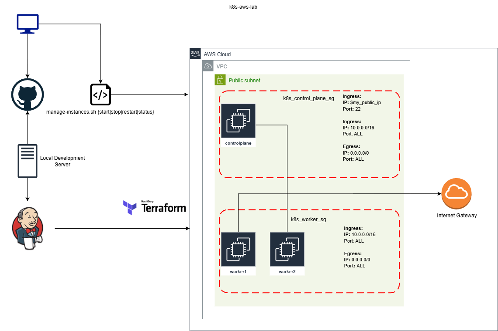

# k8s-aws-lab
A small automated k8s aws lab for learning and exam prep 

The idea was to create 3 EC2's 1 controlplane and 2 worker nodes which get created and configured via terraform and shell scipts with ssh access to control plane then it has access to the workers.

## Required Variables in Jenkins:

```sh
AWS_DEFAULT_REGION='us-east-1'
AWS_DEFAULT_AVAILABILITY_ZONE='us-east-1a'
TF_STATE_BUCKET='my-bucket'
K8_TF_STATE_KEY='k8s-aws-lab/terraform.tfstate'
SSH_PUBLIC_KEY='ssh-rsa AAAAB3NzaC1yc2EAAAADAQABAAABAQCy... user@host'
```

## Required Credentials:

- AWS Credentials (type: AWS Credentials)
- `SSH_PUBLIC_KEY` (type: Secret Text)
 - Used to create EC2 Key Pair for external SSH access

## Kubernetes Setup:

- Kubeadm to initialize cluster 
- Calico network plugin (Supports Network Policies)
- Join cluster command outputted to `~/join-command.txt` on Control Plane node
 - SSH to Worker nodes and run command manually after cluster set up
- Internal SSH key pair for communication between Control Plane and Worker nodes
 - Created and stored at runtime via terraform and rendered into `.sh.tpl` bootstrap files
- k alias for kubectl configured and command completion enabled
 - `alias k='kubectl'`
 - `source <(kubectl completion bash)`

## Architecture:



## Terraform Resources:

### AWS Resources
- `aws_vpc.k8s_vpc`: Defines a VPC with CIDR block 10.0.0.0/16.
- `aws_internet_gateway.k8s_igw`: Attaches an internet gateway to the VPC.
- `aws_route_table.k8s_route_table`: Creates a route table with a default route to the internet gateway.
- `aws_route_table_association.k8s_rta_public`: Associates the route table with the public subnet.
- `aws_subnet.k8s_subnet_public`: Defines a public subnet in the VPC with CIDR block 10.0.1.0/24.
- `aws_security_group.k8s_control_plane_sg`: Security group for control plane instances, allowing SSH from a specific IP and full internal VPC access.
- `aws_security_group.k8s_worker_sg`: Security group for worker instances, allowing SSH from control plane and full internal VPC access.
- `aws_key_pair.k8s_key_pair`: Deploys an SSH key pair for instance access.
- `aws_instance.control_plane`: Launches a single t3.medium EC2 instance for the Kubernetes control plane, using Ubuntu AMI, with user data from a template.
- `aws_instance.worker`: Launches 2 t3.medium EC2 instances for Kubernetes workers (via count=2), using Ubuntu AMI, with user data from a template.

### TLS Resources
- `tls_private_key.internal_ssh_key`: Generates an RSA private key (4096 bits) for internal node communication.

### Null Resources
- `null_resource.control_plane_bootstrap`: Triggers re-execution of control plane user data on script changes (via filemd5 trigger).
- `null_resource.worker_node_bootstrap`: Triggers re-execution of worker user data on script changes (via filemd5 trigger).

## EC2 Management Script:

Requires AWS CLI configured with appropriate permissions and region set

`./bin/manage-instances.sh {start|stop|restart|status}`

```sh
> ./bin/manage-instances.sh status
------------------------------------
|         DescribeInstances        |
+----------------------+-----------+
|  i-0f2422525f3bde9fb |  stopped  |
|  i-07dc17779def0d3a2 |  stopped  |
|  i-02dd18448b6badcd6 |  stopped  |
+----------------------+-----------+
```

## Troubleshooting:

The bootstrap scripts log output to these locations:

- `control-plane-bootstrap.sh` > `/var/log/control-plane-bootstrap.log`
- `worker-node-bootstrap.sh` > `/var/log/worker-node-bootstrap.log`
